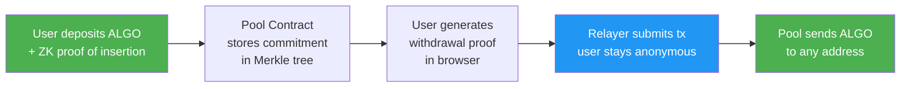
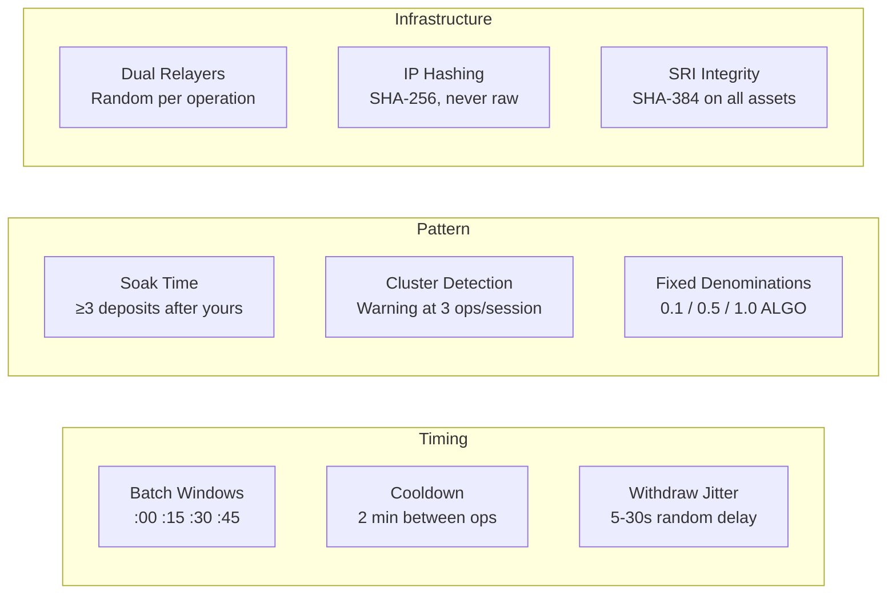

# 2birds

Private transactions on Algorand. Deposit ALGO, withdraw to any address — nobody can link the two.

**Try it**: [2birds.pages.dev](https://2birds.pages.dev) (Algorand Testnet)

---

## What is this?

2birds is a privacy pool. You deposit ALGO into a shared pool with other users, and later withdraw the same amount to a completely different address. A zero-knowledge proof guarantees you deposited without revealing *which* deposit is yours.

Think of it like putting cash into a shared jar, getting a receipt, and later redeeming that receipt at a different window. Nobody watching the jar can connect your deposit to your withdrawal.

### How to use it

1. Install [Pera Wallet](https://perawallet.app) and switch to Testnet
2. Get free testnet ALGO from the [dispenser](https://bank.testnet.algorand.network/)
3. Go to [2birds.pages.dev](https://2birds.pages.dev) and connect your wallet
4. Pick a pool tier (0.1, 0.5, or 1.0 ALGO) and deposit
5. Wait for a few other people to deposit
6. Withdraw to any address you want — it's private

### What does it cost?

| Action | You pay |
|--------|---------|
| Deposit | Pool amount + 0.057 ALGO fee |
| Withdraw | 0.05 ALGO (taken from your withdrawal) |

That's it. No subscriptions, no tokens, no hidden fees. The infrastructure runs on Cloudflare's free tier — **$0/month**.

---

## For Algorand Developers

### How it works under the hood



- **ZK proofs** generated client-side with snarkjs (PLONK on BN254)
- **Verified on-chain** via PLONK LogicSig — 4 txns at 0.001 ALGO each (30x cheaper than Groth16 app calls)
- **Relayer** submits withdrawals so the user's wallet never touches the withdraw transaction
- **Notes encrypted on-chain** via HPKE — recoverable even if you clear your browser

### Key design decisions

| Decision | Why |
|----------|-----|
| **PLONK over Groth16** | Same security, 30x cheaper (0.007 vs 0.2 ALGO per op) |
| **Relayer** | Without it, the withdrawer submits their own tx — linkable by IP and wallet |
| **Fixed denominations** | If amounts vary, deposits and withdrawals can be matched by amount |
| **HPKE note backup** | Other mixers use localStorage only — clear browser = lose funds |
| **Dual relayers** | No single operator sees all traffic |
| **One-shot verifier lock** | `setPlonkVerifiers` can only be called once — creator can't swap verifiers |

### Contracts (Testnet)

| Contract | App ID |
|----------|--------|
| Pool — 0.1 ALGO | `756478534` |
| Pool — 0.5 ALGO | `756478549` |
| Pool — 1.0 ALGO | `756480627` |

PLONK verifier addresses are permanently locked on each pool via one-shot `setPlonkVerifiers`.

### Quick start

```bash
npm install
cd frontend && npm run build                                          # build frontend
cd frontend && npx wrangler pages deploy dist --project-name 2birds   # deploy
cd relayer && npm run deploy                                          # deploy relayer
```

---

## Technical Deep Dive

For Foundation reviewers, auditors, and ZK engineers. Full details in [`docs/`](docs/).

### Architecture

```mermaid
graph TB
    subgraph "Frontend — 2birds.pages.dev"
        UI[TransactionFlow UI]
        HOOKS[useTransaction Hook]
        PRIV[privacy.ts — MiMC, notes, recovery]
        TREE[tree.ts — Client-side Merkle tree]
        HPKE[hpke.ts — Encrypted on-chain notes]
        SCAN[scanner.ts — Chain note recovery]
        AC[Anti-Correlation<br/>Soak · Cooldown · Jitter]
    end

    subgraph "ZK Circuits — Circom + snarkjs"
        DC[Deposit ~42K constraints]
        WC[Withdraw ~23K constraints]
        PSC[PrivateSend ~44K constraints]
        SC[Split ~66K constraints]
        CC[Combine ~66K constraints]
    end

    subgraph "Algorand AVM v11"
        PLONK["PLONK LogicSig Verifiers<br/>4 txns per proof, 0.004 ALGO"]
        PP1["Pool 0.1 ALGO"]
        PP5["Pool 0.5 ALGO"]
        PP10["Pool 1.0 ALGO"]
    end

    subgraph "Infrastructure"
        REL1[Relayer 1<br/>CF Worker]
        REL2[Relayer 2<br/>CF Worker]
        R2[Cloudflare R2<br/>PLONK zkeys]
        IPFS[IPFS Fallback<br/>zkey mirror]
    end

    UI --> HOOKS
    HOOKS --> PRIV & TREE & HPKE & AC
    HOOKS -->|snarkjs| DC & WC & PSC & SC & CC
    HOOKS -->|LogicSig group| PLONK
    HOOKS -->|app call| PP1 & PP5 & PP10
    SCAN -->|indexer| PP1 & PP5 & PP10
    HOOKS -->|fetch zkeys| R2
    R2 -.->|fallback| IPFS
    REL1 & REL2 -->|submit withdrawal| PLONK
    REL1 & REL2 -->|app call| PP1 & PP5 & PP10

    style PLONK fill:#4CAF50,color:#fff
    style AC fill:#e91e63,color:#fff
```



### Cryptographic primitives

| Primitive | Implementation | Purpose |
|-----------|---------------|---------|
| PLONK proof system | Circom 2.1.6 + snarkjs, BN254 curve | Membership/insertion proofs |
| LogicSig verification | 4 txns, BN254 pairing check in TEAL | On-chain proof verification (0.004 ALGO) |
| MiMC Sponge | 220 rounds, x^5 Feistel, circomlib-compatible | Merkle tree hashing + commitment |
| HPKE | X25519 + HKDF-SHA256 + ChaCha20-Poly1305 | Encrypted note backup in txn notes |
| Key derivation | HKDF for view keys, MiMC for spend secrets | View/spend separation |
| Privacy addresses | Bech32 `priv1...` (66-byte payload) | Algo pubkey + X25519 view pubkey |
| Merkle tree | Incremental, depth 16, ~65K leaf capacity | Commitment storage + membership proofs |

### Anti-correlation protections



### 2birds vs HermesVault

| | 2birds | HermesVault |
|---|---|---|
| **Proof system** | PLONK (circom/snarkjs) | PLONK (gnark/AlgoPlonk) |
| **Cost per op** | ~0.007 ALGO | ~0.007 ALGO |
| **Relayer** | Yes (0.05 ALGO) | No |
| **Denomination tiers** | 0.1 / 0.5 / 1.0 ALGO | 10 / 100 / 1000 ALGO |
| **Unlinkability** | Full — relayer breaks tx graph | Partial — user submits own tx |
| **Note backup** | HPKE encrypted on-chain | localStorage only |
| **View/spend keys** | Yes | No |
| **Privacy addresses** | Yes (priv1...) | No |
| **Anti-correlation** | Soak, cooldown, jitter, cluster | None |
| **Split/combine** | Yes | No |
| **Contract trust** | Immutable (one-shot lock) | Immutable |
| **IP protection** | SHA-256 hashed | Exposed to RPC |
| **SRI integrity** | Yes | No |

| Attack Vector | 2birds | HermesVault |
|---|---|---|
| Timing correlation | **Mitigated** — jitter, cooldown, batch windows | Vulnerable |
| Deposit-withdraw linking | **Mitigated** — relayer breaks tx graph | Vulnerable — user submits own tx |
| IP metadata | **Mitigated** — SHA-256 hashed | Vulnerable — exposed to RPC |
| Note loss | **Mitigated** — HPKE on-chain backup | Vulnerable — localStorage only |
| Sybil / instant withdraw | **Mitigated** — soak time, cluster detection | Vulnerable |
| Frontend tampering | **Mitigated** — SRI + CSP | Vulnerable |
| Amount correlation | Mitigated — fixed tiers + split/combine | Mitigated — fixed tiers |
| Anonymity set | Depends on usage | Depends on usage |

**Score: 2birds 7/8 mitigated, HermesVault 2/8.**

### Detailed docs

| Doc | Contents |
|-----|----------|
| [Architecture](docs/architecture.md) | System diagrams, deposit/withdraw/privateSend flows, PLONK LogicSig verification, Merkle tree |
| [Cryptography](docs/cryptography.md) | Key derivation, HPKE envelope format, chain scanning, privacy addresses |
| [Security](docs/security.md) | Anti-correlation protections, trust model, exploitability comparison |
| [Contracts](docs/contracts.md) | App IDs, verifier addresses, MBR costs, deployment, project structure |

### Tech stack

Circom 2.1.6 + snarkjs (PLONK/Groth16, BN254) | TealScript | React + Vite | Cloudflare Pages/Workers/R2 | IPFS | AVM v11

## License

MIT
