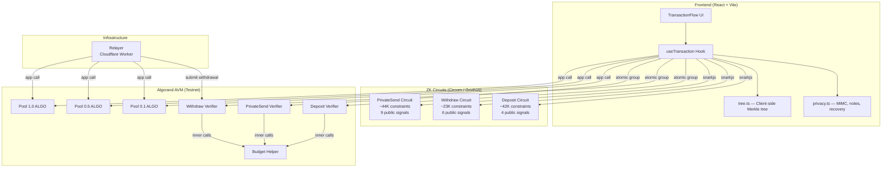
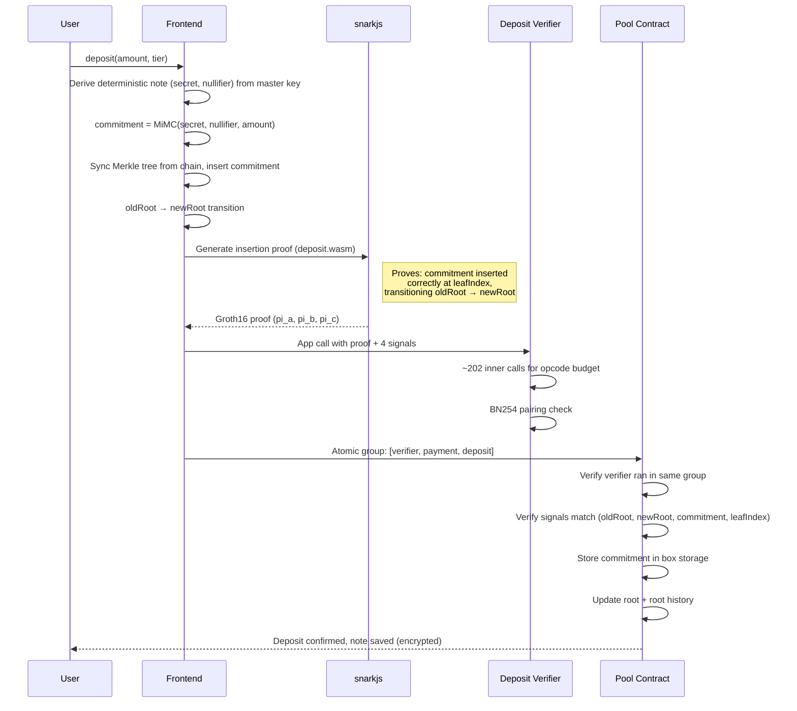
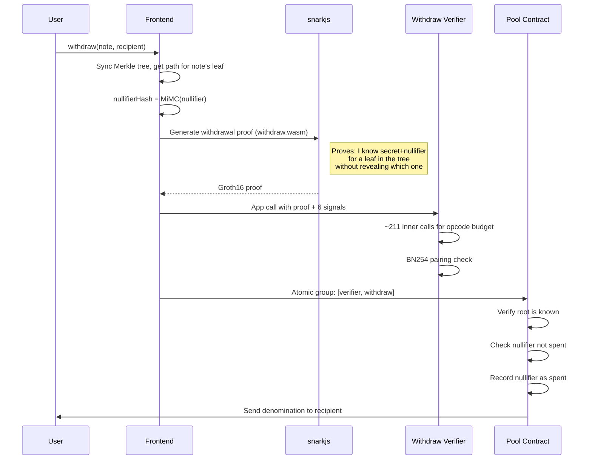
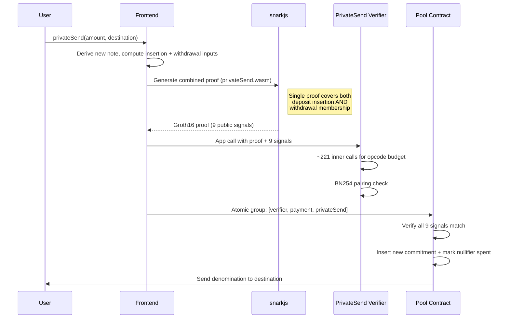
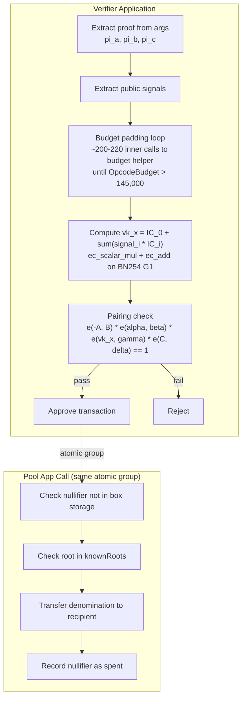
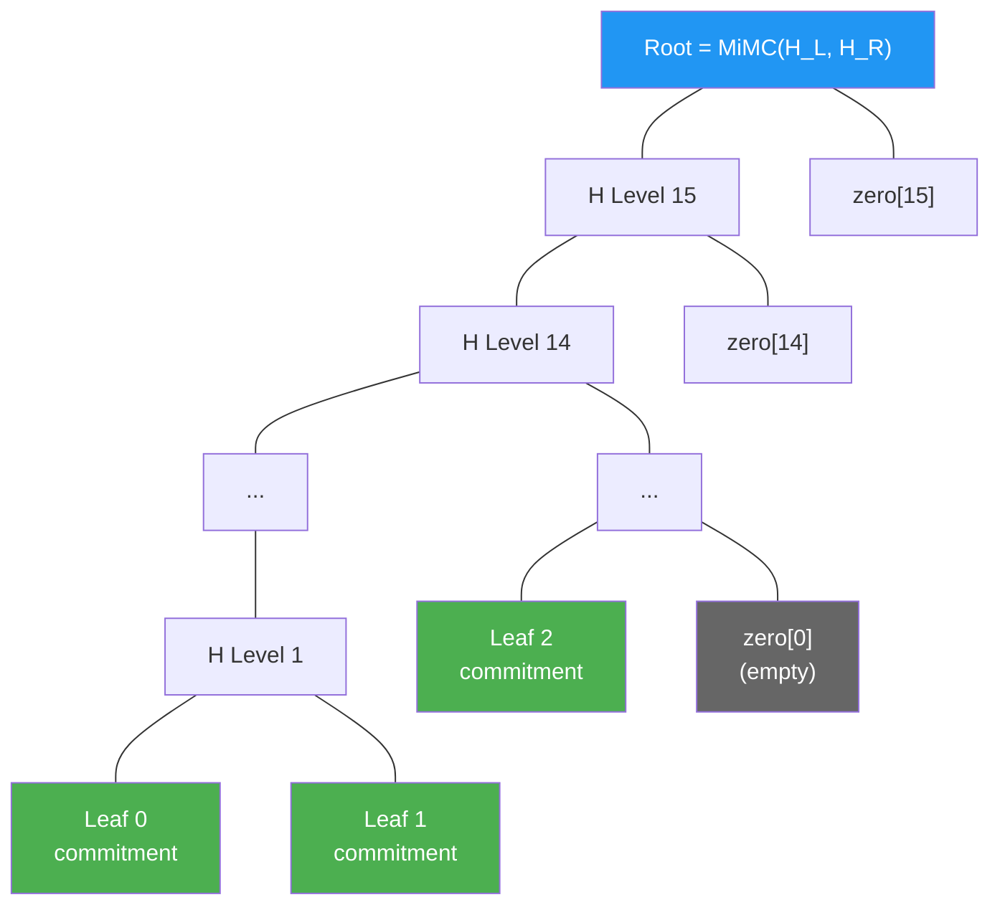
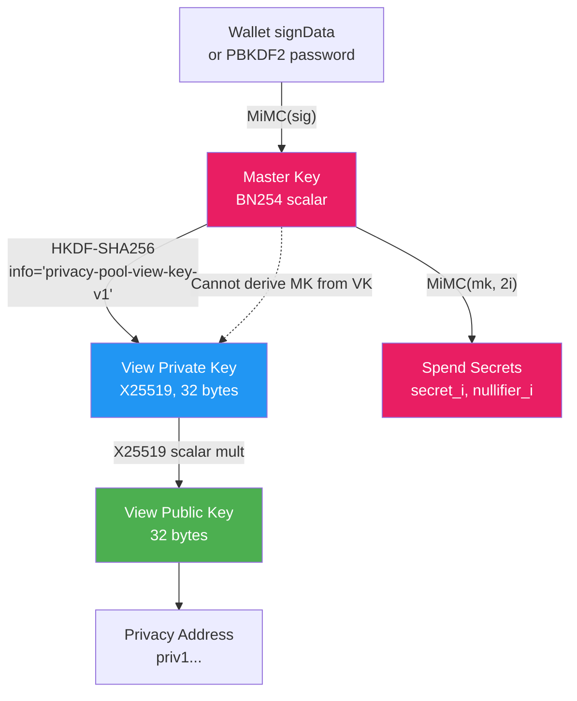
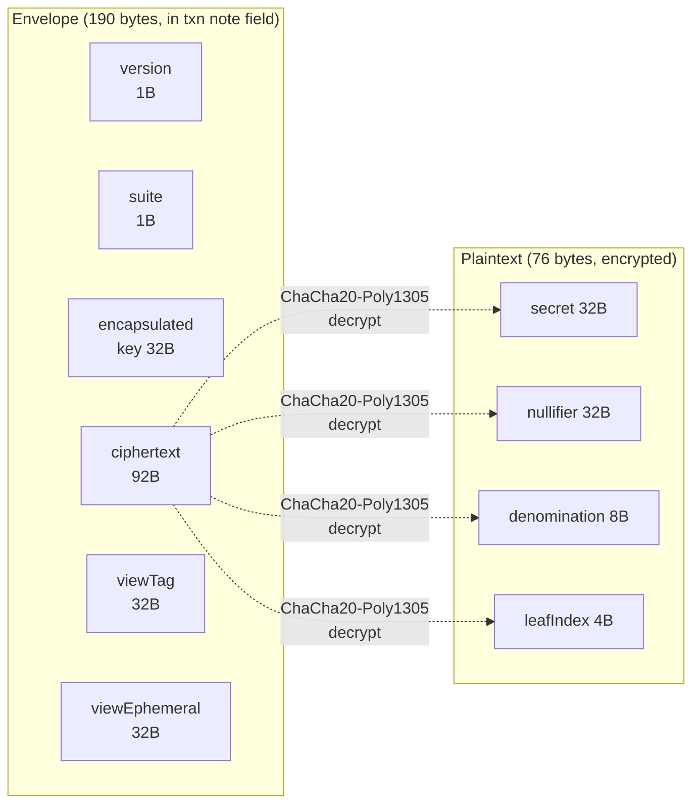
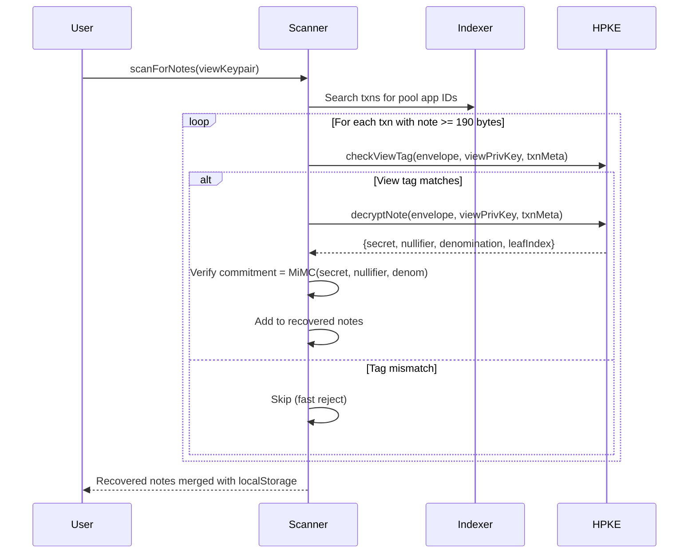
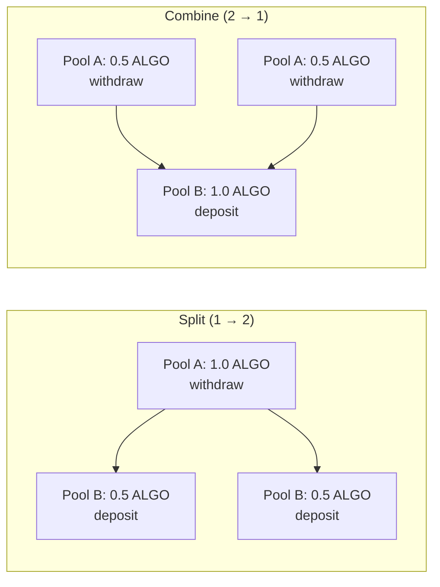

# privacy-sdk

Zero-knowledge privacy primitives for Algorand. Deposit ALGO into fixed-denomination pools, then withdraw to any address with a Groth16 ZK proof — breaking the on-chain link between sender and receiver. Powered by BN254 curve operations on the AVM.

## Architecture



## How It Works

### Deposit Flow



### Withdraw Flow



### PrivateSend Flow (Combined Deposit + Withdraw)



### Groth16 Verification on AVM



### Merkle Tree (Incremental, Depth 16)



Each leaf is `MiMC(secret, nullifier, amount)`. Siblings are hashed up with MiMC Sponge (220 rounds, x^5 Feistel). Empty leaves use precomputed zero hashes. Tree supports ~65K deposits (2^16 leaves).

## Features

| Feature | Status | Notes |
|---------|--------|-------|
| Wallet connect (Pera/Defly) | Working | via @txnlab/use-wallet-react |
| Multi-tier pools (0.1 / 0.5 / 1.0 ALGO) | Working | Fixed-denomination pools for anonymity sets |
| Deposit with ZK insertion proof | Working | Groth16 proof that commitment was correctly inserted |
| Withdraw to any address | Working | ZK proof of Merkle membership without revealing leaf |
| Private Send (atomic deposit+withdraw) | Working | Single combined proof, saves one verifier call |
| Relayer for private withdrawals | Working | Cloudflare Worker submits txn on user's behalf |
| Deterministic note derivation | Working | Master key from wallet signature (ARC-0047 signData) |
| Encrypted note storage | Working | AES-256-GCM derived from master key via HKDF |
| Password fallback | Working | PBKDF2 key derivation for wallets without signData |
| Note recovery | Working | Re-derives notes from master key, scans chain for matches |
| Pool balance badge | Working | Queries indexer for grouped deposits minus withdrawals |
| Animated pool blob | Working | Metaball visualization scales with pool balance |
| Cost breakdown | Working | Per-operation fee breakdown with tooltip explanations |
| HPKE encrypted notes | Working | Notes encrypted with X25519/ChaCha20-Poly1305 in txn note field |
| View/spend key separation | Working | X25519 view key for note decryption, master key for spending |
| Privacy addresses (priv1...) | Working | Bech32-encoded address with Algorand pubkey + view pubkey |
| Chain scanner (HPKE) | Working | Scans on-chain txn notes with view key to recover encrypted notes |
| Split circuit | Planned | Split 1.0 ALGO into 2 × 0.5 ALGO across pools |
| Combine circuit | Planned | Combine 2 × 0.5 ALGO into 1.0 ALGO across pools |

### View/Spend Key Derivation



The view key can decrypt HPKE envelopes to see note contents (amounts, leaf indices) but cannot spend notes. The master key is required for spending (deriving secrets and nullifiers).

### HPKE Envelope Format



HPKE suite: X25519 + HKDF-SHA256 + ChaCha20-Poly1305. View tag enables fast scanning (ECDH check) before full HPKE decryption.

### Chain Scanning Flow



### Privacy Address Format

```
priv1... (bech32-encoded)
┌─────────┬──────────┬───────────────┬───────────────┐
│ version │ network  │ algo_pubkey   │ view_pubkey   │
│  (1B)   │  (1B)    │   (32B)       │   (32B)       │
└─────────┴──────────┴───────────────┴───────────────┘
         Total payload: 66 bytes
```

Share your `priv1...` address to receive private transfers. Senders decode it to get your Algorand address (for on-chain recipient) and view public key (for HPKE encryption). Recipients scan the chain with their view key to discover notes.

### Split/Combine Flow



Split/combine circuits prove denomination conservation across pools: `denomA == 2 * denomB` (split) or `2 * denomA == denomB` (combine). Single ZK proof covers the withdrawal(s) from pool A and deposit(s) into pool B.

## Project Structure

```
privacy-sdk/
├── circuits/
│   ├── deposit.circom              # Insertion proof (~42K constraints, depth 16)
│   ├── withdraw.circom             # Withdrawal proof (~23K constraints, depth 16)
│   ├── privateSend.circom          # Combined deposit+withdraw (~44K constraints)
│   ├── split.circom                # Split 1→2 across pools (denomination conservation)
│   ├── combine.circom              # Combine 2→1 across pools (denomination conservation)
│   ├── merkleTree.circom           # MiMC Merkle tree checker + commitment hasher
│   ├── range-proof.circom          # Amount range proofs (future)
│   ├── shielded-transfer.circom    # Full shielded transfer (future)
│   ├── build.sh                    # Circuit compilation + trusted setup
│   └── build/                      # Compiled WASM, zkeys, vkeys, ptau
├── contracts/
│   ├── privacy-pool.algo.ts        # Main pool: deposit, withdraw, privateSend
│   ├── stealth-registry.algo.ts    # Stealth meta-address registry
│   ├── shielded-pool.algo.ts       # Full UTXO privacy system (future)
│   ├── confidential-asset.algo.ts  # Hidden transfer amounts (future)
│   ├── generate-verifier.ts        # Generates TEAL verifier from vkey.json
│   ├── deposit_verifier.teal       # Generated Groth16 verifier (4 signals)
│   ├── withdraw_verifier.teal      # Generated Groth16 verifier (6 signals)
│   ├── privateSend_verifier.teal   # Generated Groth16 verifier (9 signals)
│   ├── budget_helper.teal          # NoOp app for opcode budget padding
│   └── artifacts/                  # Compiled TealScript ARC-56 artifacts
├── frontend/
│   ├── src/
│   │   ├── App.tsx                 # Main layout, badges, blob
│   │   ├── components/
│   │   │   ├── TransactionFlow.tsx # Deposit / Quick Send / Manage tabs
│   │   │   ├── PasswordModal.tsx   # Password fallback for Pera wallets
│   │   │   ├── CostBreakdown.tsx   # Fee breakdown with tooltips
│   │   │   ├── PoolBlob.tsx        # Animated background blob
│   │   │   └── StatusBar.tsx       # Network/wallet status
│   │   ├── hooks/
│   │   │   ├── useTransaction.ts   # deposit, withdraw, privateSend logic
│   │   │   └── usePoolState.ts     # Pool balance, user balance, wallet balance
│   │   ├── lib/
│   │   │   ├── privacy.ts          # MiMC, commitments, encrypted storage, recovery
│   │   │   ├── keys.ts             # View/spend key derivation (HKDF + X25519)
│   │   │   ├── address.ts          # Bech32 priv1... privacy address format
│   │   │   ├── hpke.ts             # HPKE envelope encrypt/decrypt (190-byte format)
│   │   │   ├── scanner.ts          # Chain scanner for HPKE-encrypted note recovery
│   │   │   ├── tree.ts             # Client-side MiMC Merkle tree (depth 16)
│   │   │   ├── config.ts           # Contract addresses, fees, tiers, relayer
│   │   │   └── errorMessages.ts    # Human-readable error mapping
│   │   └── styles/
│   │       ├── globals.css         # Theme variables, fonts
│   │       └── components.css      # All component styles
│   └── public/
│       ├── circuits/               # deposit/withdraw/privateSend .wasm + .zkey
│       └── contracts/              # TEAL files for reference
├── relayer/
│   ├── src/index.ts                # Cloudflare Worker — relayed withdrawals
│   └── wrangler.toml               # Worker config
├── scripts/
│   ├── deploy-all.ts               # Deploy all contracts + verifiers
│   ├── deploy-pool-v2.ts           # Deploy multi-tier pool contracts
│   ├── deploy-verifier.ts          # Deploy verifier + budget helper
│   └── fund-pools.ts               # Fund pool contracts with ALGO
├── packages/                       # Legacy SDK packages (monorepo)
│   ├── core/                       # BN254 curve ops, MiMC hash
│   ├── pool/                       # Privacy pool SDK
│   ├── stealth/                    # Stealth address protocol
│   ├── shielded/                   # Full UTXO privacy
│   ├── confidential/               # Hidden amounts (Pedersen)
│   ├── relayer/                    # HTTP relayer SDK
│   ├── circuits/                   # Circuit artifacts
│   └── cli/                        # Command-line interface
├── demo.ts                         # Interactive demo (no blockchain needed)
└── test-proof.ts                   # Local ZK proof generation + verification
```

## Contracts (Testnet)

| Contract | App ID | Notes |
|----------|--------|-------|
| Pool — 0.1 ALGO | 756420118 | Fixed denomination pool |
| Pool — 0.5 ALGO | 756420130 | Fixed denomination pool |
| Pool — 1.0 ALGO | 756420132 | Fixed denomination pool (default) |
| Deposit Verifier | 756420115 | Groth16 BN254 pairing — 4 public signals |
| Withdraw Verifier | 756420114 | Groth16 BN254 pairing — 6 public signals |
| PrivateSend Verifier | 756420116 | Groth16 BN254 pairing — 9 public signals |
| Budget Helper | 756420102 | NoOp app for opcode budget padding |
| Stealth Registry | 756386179 | Stealth meta-address registry |
| Shielded Pool | 756386192 | Full UTXO privacy system (future) |
| Confidential Asset | 756386193 | Hidden transfer amounts (future) |

## On-Chain Costs

| Operation | Cost | Details |
|-----------|------|---------|
| Deposit | ~0.206 ALGO | Deposit verifier (~202 inner calls) + payment + pool app call |
| Withdraw | ~0.215 ALGO | Withdraw verifier (~211 inner calls) + pool app call |
| Private Send | ~0.226 ALGO | PrivateSend verifier (~221 inner calls) + payment + pool app call |
| Relayed Withdraw | 0.25 ALGO | Deducted from withdrawal amount, paid to relayer |
| Split (1→2) | ~0.44 ALGO | Split verifier + pool A withdraw + pool B 2× deposit (estimated) |
| Combine (2→1) | ~0.44 ALGO | Combine verifier + pool A 2× withdraw + pool B deposit (estimated) |

Most of the cost comes from the ZK proof verification step — the BN254 pairing check needs ~145,000 opcodes, which requires ~200-220 inner app calls to the budget helper at 0.001 ALGO each. The exact count varies by circuit (more public signals = more `ec_scalar_mul` operations).

## Live Frontend

**URL**: https://algo-privacy.pages.dev (Cloudflare Pages, Algorand Testnet)

To use: Install Pera Wallet, go to Settings > Developer Settings > Node Settings > Testnet, fund from the [testnet dispenser](https://bank.testnet.algorand.network/), then connect at the URL above.

**Build & Deploy**:
```bash
cd frontend && npx vite build
npx wrangler pages deploy dist --project-name algo-privacy --branch main --commit-dirty=true
```

## Quick Start

```bash
# Install dependencies
npm install

# Run the interactive demo (no blockchain needed)
npx tsx demo.ts

# Generate and verify a real ZK proof locally
npx tsx test-proof.ts

# Build ZK circuits (requires circom + snarkjs)
cd circuits && bash build.sh

# Deploy to testnet (requires funded deployer wallet)
npx tsx scripts/deploy-all.ts
```

## Tech Stack

- **Circuits**: Circom 2.1.6 + snarkjs (Groth16, BN254)
- **Curve**: BN254 (alt_bn128) — native AVM v11 support
- **Hash**: MiMC Sponge (220 rounds, x^5 Feistel) — circomlib-compatible
- **Contracts**: TealScript (compiles to TEAL for AVM)
- **Verifiers**: Generated TEAL from verification keys (gnark-crypto G2 encoding)
- **Frontend**: React + Vite, deployed on Cloudflare Pages
- **Relayer**: Cloudflare Worker (TypeScript)
- **Proving**: snarkjs WASM prover (~2-10s proof generation in browser)
- **Verification**: BN254 pairing check via AVM opcodes (`ec_add`, `ec_scalar_mul`, `ec_pairing_check`)
- **Storage**: AES-256-GCM encrypted notes in localStorage, HKDF-derived from master key
- **HPKE**: X25519 + HKDF-SHA256 + ChaCha20-Poly1305 for encrypted on-chain notes
- **View Keys**: X25519 keypair derived via HKDF from master key
- **Addresses**: Bech32 `priv1...` format encoding Algorand pubkey + view pubkey

## AVM Requirements

- AVM v11 for BN254 curve operations (`ec_scalar_mul`, `ec_add`, `ec_pairing_check`)
- Box storage for Merkle tree commitments, nullifier set, root history (ring buffer of 1000)
- Application opcode budget pooling (~200-220 inner calls to budget helper for ~145K+ opcodes)

## Known Issues

- **Note persistence**: Notes are stored both encrypted in localStorage (AES-256-GCM) and as HPKE envelopes in on-chain txn note fields. Chain scanning with your view key recovers notes even after clearing browser data.
- **Concurrent deposits**: If another user deposits during your proof generation (~10-30s), the root changes and the proof becomes invalid. The frontend automatically retries up to 3 times.
- **Quick Send privacy**: PrivateSend deposits and withdraws in the same block, publicly linking both transactions. For maximum privacy, deposit first, wait for pool activity, then withdraw separately.
- **Pool balance accuracy**: Uses indexer to count grouped payments minus inner-txn payments. Polls every 30s.
- **View key compromise**: If an attacker obtains your view key (derived from master key via HKDF), they can decrypt all HPKE envelopes and see note contents. They cannot spend notes (requires master key). This is by design — view keys enable auditors/compliance without spend authority.
- **Split/combine circuits**: Not yet compiled or deployed. The circuits are defined but require trusted setup (`./build.sh split` / `./build.sh combine`) and verifier deployment before use.

## License

MIT
