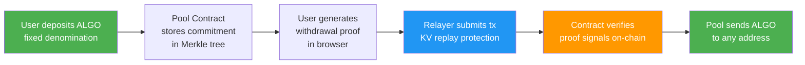
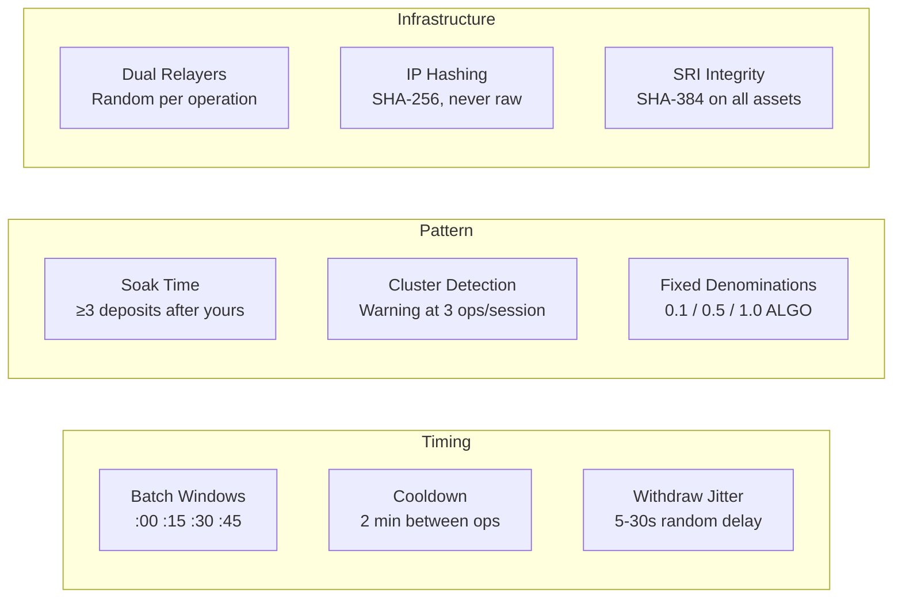
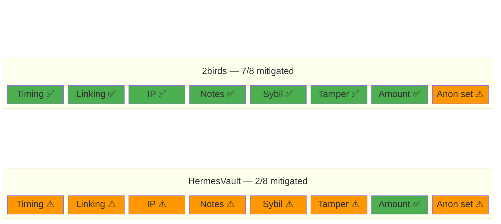

# 2birds

Private transactions on Algorand. Deposit ALGO, withdraw to any address — nobody can link the two.

**Try it**: [2birds.pages.dev](https://2birds.pages.dev) (Algorand Testnet)

---

## What is this?

2birds is a privacy pool for Algorand. You deposit ALGO into a shared pool with other users, and later withdraw the same amount to a completely different address. A zero-knowledge proof guarantees you deposited without revealing *which* deposit is yours.

Think of it like putting cash into a shared jar, getting a receipt, and later redeeming that receipt at a different window. Nobody watching the jar can connect your deposit to your withdrawal.

### The privacy trade-off

Blockchain transactions are public by default — anyone can trace where your ALGO went. 2birds breaks that link, but **your privacy depends on how you use it**.

You *can* withdraw immediately after depositing, but if only one person deposited recently, it's obvious who withdrew. You're hiding in a crowd — the bigger the crowd, the better the privacy. This is called the **anonymity set**.

| Stronger privacy | Weaker privacy |
|---|---|
| More deposits in the pool before you withdraw | Withdrawing right after depositing |
| Waiting longer between deposit and withdrawal | Small pool with few users |
| Using the relayer (your wallet never touches the withdraw tx) | Repeating the same pattern (same amounts, regular timing) |

2birds has built-in protections (batch windows, cooldown timers, jitter, soak time) but privacy is a spectrum, not a switch.

### How to use it

1. Install [Pera Wallet](https://perawallet.app) and switch to Testnet
2. Get free testnet ALGO from the [dispenser](https://bank.testnet.algorand.network/)
3. Go to [2birds.pages.dev](https://2birds.pages.dev) and connect your wallet
4. Pick a pool tier (0.1, 0.5, or 1.0 ALGO) and deposit
5. Wait for other people to deposit (the longer you wait, the better your privacy)
6. Withdraw to any address you want — the relayer submits the transaction so it can't be linked back to you

### What does it cost?

| Action | You pay |
|--------|---------|
| Deposit | Pool amount + 0.057 ALGO fee |
| Withdraw | 0.05 ALGO (taken from your withdrawal) |

No subscriptions, no tokens, no hidden fees. The infrastructure runs on Cloudflare's free tier — **$0/month**.

---

## For Algorand Developers

### How it works under the hood



- **ZK proofs** generated client-side with snarkjs (PLONK on BN254)
- **Verified on-chain** via PLONK LogicSig — 4 txns at 0.001 ALGO each (30x cheaper than Groth16 app calls)
- **Relayer** submits withdrawals so the user's wallet never touches the withdraw transaction
- **Notes encrypted on-chain** via HPKE — recoverable even if you clear your browser

### Key design decisions

| Decision | Why |
|----------|-----|
| **PLONK over Groth16** | Same security, 30x cheaper (0.007 vs 0.2 ALGO per op) |
| **Relayer** | Without it, the withdrawer submits their own tx — linkable by IP and wallet |
| **Fixed denominations** | If amounts vary, deposits and withdrawals can be matched by amount |
| **HPKE note backup** | Other mixers use localStorage only — clear browser = lose funds |
| **Dual relayers** | No single operator sees all traffic |
| **One-shot verifier lock** | `setPlonkVerifiers` can only be called once — creator can't swap verifiers |
| **Signal binding** | Proof public signals verified on-chain — prevents replay/substitution |
| **Denomination enforcement** | Contract-enforced fixed tiers — prevents commitment-amount mismatch |
| **Falcon PQ mode** | Optional Falcon-1024 post-quantum signing via AVM v12 `falcon_verify` |

### Contracts (Testnet)

| Contract | App ID |
|----------|--------|
| Pool — 0.1 ALGO | `756813724` |
| Pool — 0.5 ALGO | `756862750` |
| Pool — 1.0 ALGO | `756862851` |

PLONK verifier addresses are permanently locked on each pool via one-shot `setPlonkVerifiers`.

### Quick start

```bash
npm install
cp .env.example .env                # add your deployer mnemonic
cp frontend/.env.example frontend/.env  # add your WalletConnect project ID
```

```bash
cd frontend && npm run build                                          # build frontend
cd frontend && npx wrangler pages deploy dist --project-name 2birds   # deploy
cd relayer && npm run deploy                                          # deploy relayer
```

### Environment variables

**Root `.env`** (for deploy scripts):

| Variable | Required | Description |
|----------|----------|-------------|
| `DEPLOYER_MNEMONIC` | Yes | 25-word Algorand mnemonic for deploying contracts |
| `DEPLOYER_ADDRESS` | Yes | Corresponding Algorand address |
| `ALGOD_URL` | No | Algod endpoint (defaults to algonode testnet) |

**Frontend `frontend/.env`**:

| Variable | Required | Description |
|----------|----------|-------------|
| `VITE_WC_PROJECT_ID` | Yes | WalletConnect v2 project ID — get one free at [cloud.walletconnect.com](https://cloud.walletconnect.com) |
| `VITE_NETWORK` | No | `testnet` (default) or `mainnet` |
| `VITE_USE_PLONK_LSIG` | No | `true` (default) — use cheaper PLONK verification |
| `VITE_RELAYER_1_URL` | No | Override relayer 1 URL (for self-hosted relayers) |
| `VITE_RELAYER_1_ADDRESS` | No | Algorand address of relayer 1 |
| `VITE_RELAYER_2_URL` | No | Override relayer 2 URL |
| `VITE_RELAYER_2_ADDRESS` | No | Algorand address of relayer 2 |

**Relayer** (set via `wrangler secret put`, not in config files):

| Secret | Description |
|--------|-------------|
| `RELAYER_MNEMONIC` | 25-word Algorand mnemonic for the relayer wallet |
| `OPERATOR_API_KEY` | Bearer token for `/api/process-refund` — generate with `openssl rand -hex 32` |

### Running your own relayer

1. `cd relayer && npm install`
2. Create a KV namespace: `wrangler kv namespace create RELAY_KV`
3. Paste the namespace ID into `wrangler.toml`
4. Set secrets: `wrangler secret put RELAYER_MNEMONIC` and `wrangler secret put OPERATOR_API_KEY`
5. Fund the relayer Algorand address with testnet ALGO
6. Deploy: `npm run deploy`
7. Set `VITE_RELAYER_1_URL` and `VITE_RELAYER_1_ADDRESS` in your frontend `.env` to point to your relayer

---

## Technical Deep Dive

For Foundation reviewers, auditors, and ZK engineers. Full details in [`docs/`](docs/).

### Architecture

```mermaid
graph TB
    subgraph "Frontend — 2birds.pages.dev"
        UI[TransactionFlow UI]
        HOOKS[useTransaction Hook]
        PRIV[privacy.ts — MiMC, notes, recovery]
        TREE[tree.ts — Client-side Merkle tree]
        HPKE[hpke.ts — Encrypted on-chain notes]
        SCAN[scanner.ts — Chain note recovery]
        AC[Anti-Correlation<br/>Soak · Cooldown · Jitter]
        FALCON[Falcon PQ Mode<br/>Optional quantum-safe signing]
    end

    subgraph "ZK Circuits — Circom + snarkjs"
        DC[Deposit ~42K constraints]
        WC[Withdraw ~23K constraints<br/>+ relayer/fee binding]
        PSC[PrivateSend ~44K constraints<br/>+ relayer/fee binding]
        SC[Split ~66K constraints]
        CC[Combine ~66K constraints]
    end

    subgraph "Algorand AVM v12"
        PLONK["PLONK LogicSig Verifiers<br/>4 txns per proof, 0.004 ALGO"]
        PP1["Pool 0.1 ALGO"]
        PP5["Pool 0.5 ALGO"]
        PP10["Pool 1.0 ALGO"]
    end

    subgraph "Infrastructure"
        REL1[Relayer 1<br/>CF Worker + KV]
        REL2[Relayer 2<br/>CF Worker + KV]
        R2[Cloudflare R2<br/>PLONK zkeys]
        IPFS[IPFS Fallback<br/>zkey mirror]
    end

    UI --> HOOKS
    HOOKS --> PRIV & TREE & HPKE & AC
    HOOKS -.->|optional| FALCON
    HOOKS -->|snarkjs| DC & WC & PSC & SC & CC
    HOOKS -->|LogicSig group| PLONK
    HOOKS -->|app call| PP1 & PP5 & PP10
    SCAN -->|indexer| PP1 & PP5 & PP10
    HOOKS -->|fetch zkeys| R2
    R2 -.->|fallback| IPFS
    REL1 & REL2 -->|submit withdrawal| PLONK
    REL1 & REL2 -->|app call| PP1 & PP5 & PP10

    style PLONK fill:#4CAF50,color:#fff
    style AC fill:#e91e63,color:#fff
    style FALCON fill:#9C27B0,color:#fff
```



### Cryptographic primitives

| Primitive | Implementation | Purpose |
|-----------|---------------|---------|
| PLONK proof system | [Circom](https://github.com/iden3/circom) 2.1.6 + [snarkjs](https://github.com/iden3/snarkjs), BN254 curve | Membership/insertion proofs |
| LogicSig verification | 4 txns, BN254 pairing check in TEAL | On-chain proof verification (0.004 ALGO) |
| MiMC Sponge | 220 rounds, x^5 Feistel, [circomlib](https://github.com/iden3/circomlib)-compatible | Merkle tree hashing + commitment |
| HPKE | X25519 + HKDF-SHA256 + ChaCha20-Poly1305 | Encrypted note backup in txn notes |
| Key derivation | HKDF for view keys, MiMC for spend secrets | View/spend separation |
| Privacy addresses | Bech32 `priv1...` (66-byte payload) | Algo pubkey + X25519 view pubkey |
| Merkle tree | Incremental, depth 16, ~65K leaf capacity | Commitment storage + membership proofs |
| Falcon-1024 | NIST Level 5 post-quantum, AVM v12 `falcon_verify` | Optional quantum-safe transaction signing |
| Signal binding | On-chain `verifyProofWithSignals` | Proof replay / parameter substitution prevention |

### Anti-correlation protections



### 2birds vs [HermesVault](https://github.com/giuliop/HermesVault)

| | 2birds | HermesVault |
|---|---|---|
| **Proof system** | PLONK ([circom](https://github.com/iden3/circom)/[snarkjs](https://github.com/iden3/snarkjs)) | PLONK ([gnark](https://github.com/Consensys/gnark)/[AlgoPlonk](https://github.com/giuliop/AlgoPlonk)) |
| **Cost per op** | ~0.007 ALGO | ~0.007 ALGO |
| **Relayer** | Yes (0.05 ALGO) | No |
| **Denomination tiers** | 0.1 / 0.5 / 1.0 ALGO | 10 / 100 / 1000 ALGO |
| **Unlinkability** | Full — relayer breaks tx graph | Partial — user submits own tx |
| **Note backup** | HPKE encrypted on-chain | localStorage only |
| **View/spend keys** | Yes | No |
| **Privacy addresses** | Yes (priv1...) | No |
| **Anti-correlation** | Soak, cooldown, jitter, cluster | None |
| **Split/combine** | Yes | No |
| **Contract trust** | Immutable (one-shot lock) | Immutable |
| **IP protection** | SHA-256 hashed | Exposed to RPC |
| **SRI integrity** | Yes | No |

### Exploitability scorecard



| Attack Vector | 2birds | HermesVault |
|---|---|---|
| Timing correlation | **Mitigated** — jitter, cooldown, batch windows | Vulnerable |
| Deposit-withdraw linking | **Mitigated** — relayer breaks tx graph | Vulnerable — user submits own tx |
| IP metadata | **Mitigated** — SHA-256 hashed | Vulnerable — exposed to RPC |
| Note loss | **Mitigated** — HPKE on-chain backup | Vulnerable — localStorage only |
| Sybil / instant withdraw | **Mitigated** — soak time, cluster detection | Vulnerable |
| Frontend tampering | **Mitigated** — SRI + CSP | Vulnerable |
| Amount correlation | Mitigated — fixed tiers + split/combine | Mitigated — fixed tiers |
| Anonymity set | Depends on usage | Depends on usage |

### Detailed docs

| Doc | Contents |
|-----|----------|
| [Architecture](docs/architecture.md) | System diagrams, deposit/withdraw/privateSend flows, PLONK LogicSig verification, Merkle tree |
| [Cryptography](docs/cryptography.md) | Key derivation, HPKE envelope format, chain scanning, privacy addresses |
| [Security](docs/security.md) | Anti-correlation protections, trust model, exploitability comparison |
| [Contracts](docs/contracts.md) | App IDs, verifier addresses, MBR costs, deployment, project structure |

### Tech stack

[Circom](https://github.com/iden3/circom) 2.1.6 + [snarkjs](https://github.com/iden3/snarkjs) (PLONK/Groth16, BN254) | [TealScript](https://github.com/algorandfoundation/TEALScript) | React + [Vite](https://github.com/vitejs/vite) | [Cloudflare](https://developers.cloudflare.com/workers/) Pages/Workers/R2/KV | IPFS | AVM v12 | [Falcon-1024](https://falcon-sign.info/) (optional PQ)

## License

MIT
